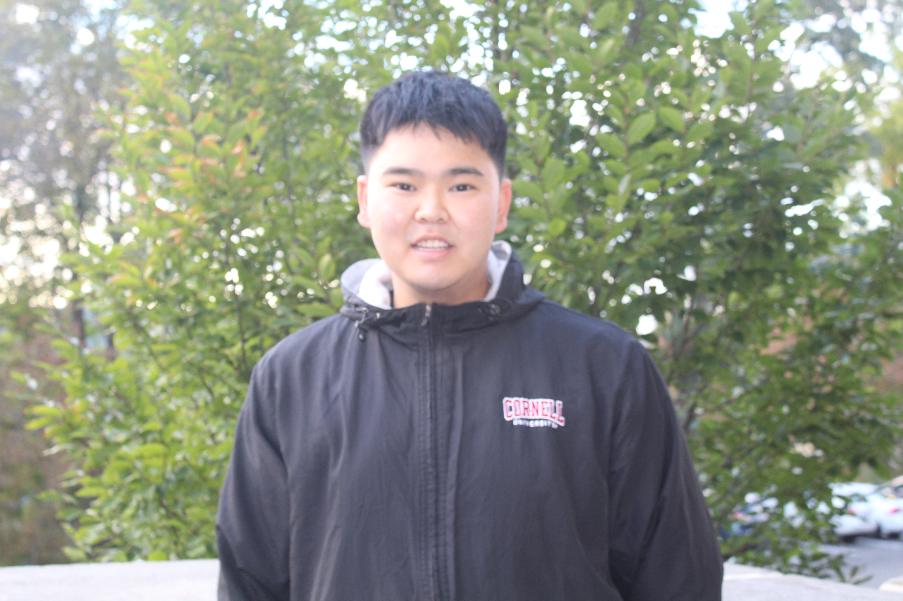

<u><b>📍 Feel Free to Check My <a href = "https://iamtaolong.github.io/">Site</a>!</u></b>

<h5> Bio: </h5>
<h6> Tao Long is a college senior studying Information Science and Communication at Cornell University. Supporting users' online behaviors and interactions in a scalable and accessible way, Tao's works falls into the beautiful field of Human-Computer Interaction(HCI). Through a human-centered lens, Tao’s research aims to understand how to design and build (computer-mediated / AI-mediated / XR-mediated) technical and social supports for collaborative environments and marginalized communities. Please go to the Projects sections to see Tao's works. </h6>
